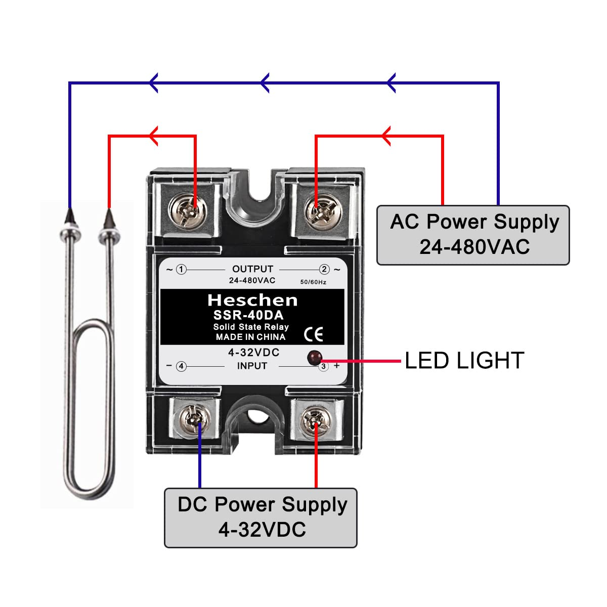

# SSR-40DA

{ width="300", align=center, data-title="SSR-40DA-001" }

# Amazon permalink

https://www.amazon.fr/gp/product/B071HP9NJD/ref=ppx_yo_dt_b_asin_title_o00_s00?ie=UTF8&psc=1

Heschen Relais statique monophasé DC/AC, SSR-40DA, entrée 4-32VDC, sortie 24-480VAC, 40A 50-60Hz
